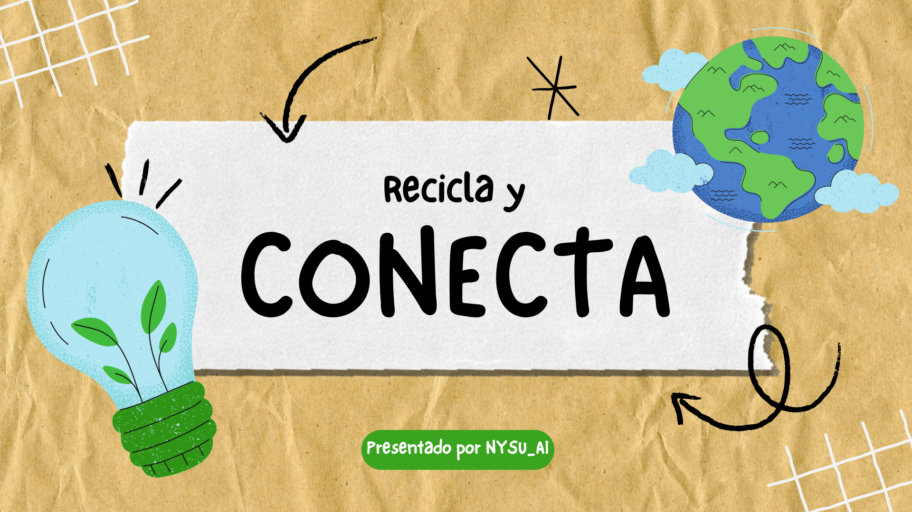

<!-- Reemplaza la ruta por tu imagen (por ejemplo: docs/images/logo.png) -->

# Backend - ConectaReciclaje

## Descripción

Este es el backend de la aplicación **ConectaReciclaje**, una plataforma para conectar ciudadanos con servicios de reciclaje. Está desarrollado con Spring Boot y proporciona una API RESTful para la gestión de usuarios, autenticación y reportes ciudadanos.

## Tecnologías Utilizadas

- **Java 17**
- **Spring Boot 3.5.6**
- **Spring Data JPA** - Para el acceso a datos
- **Spring Security** - Para autenticación y autorización
- **JWT (JSON Web Tokens)** - Para manejo de sesiones
- **MySQL** - Base de datos relacional
- **Maven** - Gestión de dependencias
- **Lombok** - Para reducir código boilerplate

## Requisitos Previos

- Java 17 o superior
- Maven 3.6+
- MySQL 8.0+
- Una base de datos MySQL llamada `conectarecicla`

## Instalación

1. Clona el repositorio:
   ```bash
   git clone <url-del-repositorio>
   cd ConectaReciclaje/backend/ConnectaReciclaje
   ```

2. Instala las dependencias:
   ```bash
   mvn clean install
   ```

## Configuración

### Base de Datos

1. Crea una base de datos MySQL llamada `conectarecicla`
2. Actualiza las credenciales en `src/main/resources/application.yml`:
   ```yaml
   spring:
     datasource:
       url: jdbc:mysql://localhost:3306/conectarecicla?useSSL=false&serverTimezone=UTC
       username: tu_usuario
       password: tu_contraseña
   ```

### JWT

La configuración JWT se encuentra en `application.yml`:
- **Secret Key**: `EstaEsUnaLlaveSuperSecretaParaJWT123456789`
- **Expiración**: 1 hora (3600000 ms)

Para producción, cambia la clave secreta por una más segura.

## Ejecución

### Desarrollo
```bash
mvn spring-boot:run
```

### Producción
```bash
mvn clean package
java -jar target/demo-0.0.1-SNAPSHOT.jar
```

La aplicación estará disponible en `http://localhost:8080`

## API Endpoints

### Autenticación
- `POST /api/auth/login` - Iniciar sesión
- `POST /api/auth/register` - Registrar nuevo usuario
- `POST /api/auth/refresh` - Refrescar token JWT

### Reportes
- `POST /api/reportes` - Crear reporte ciudadano
- `GET /api/reportes` - Obtener reportes (requiere autenticación)

## Estructura del Proyecto

```
src/main/java/com/api/connect/
├── config/           # Configuraciones de la aplicación
├── controller/       # Controladores REST
├── dto/             # Objetos de Transferencia de Datos
├── entity/          # Entidades JPA
├── filter/          # Filtros de seguridad
├── repository/      # Repositorios de datos
└── service/         # Lógica de negocio
```

## Seguridad

- Autenticación basada en JWT
- Filtro de validación JWT aplicado a rutas protegidas
- Encriptación de contraseñas con Spring Security

## Logging

- Logs de SQL de Hibernate activados para desarrollo
- Nivel DEBUG para consultas SQL
- Nivel TRACE para parámetros de consultas

## Contribución

1. Crea una rama para tu feature
2. Realiza tus cambios
3. Ejecuta las pruebas
4. Envía un Pull Request

## Licencia


Este proyecto es de código abierto bajo la licencia MIT.
